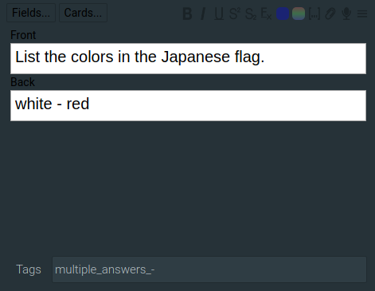
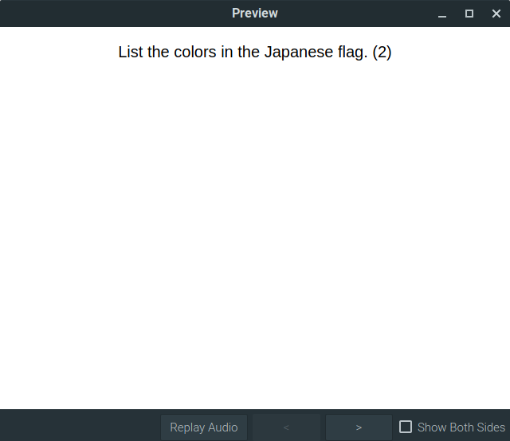

Add answer counts to Anki questions
===================================

Adds answer counts in parenthesis to questions if the note has a tag "multiple_answers" or one specified by the user.

This tag, the character by which the anwer is split into answers and the field name by which the answer is retrieved can be changed in the preferences.

On a card to card basis the split character can be changed by adding "_<split_character>" to the tag. More than one split character can be supplied.

For issues please go to https://github.com/lionawurscht/anki_addon_answer_count

   Here a custom char, "-" is used to split the answers.
   
 

   This is the result.
